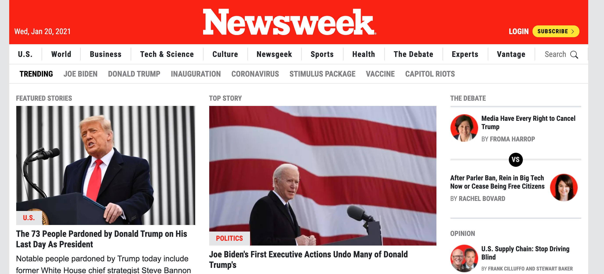

# Project 3: Using Bootstrap for Newsweek

> Third-week project of the Microverse program.

A clone of the Newsweek home page.

## Built With

- HTML5 & CSS3

## Live Demo

[Live Demo Link](https://ey-charles.github.io/mv-03-bootstrap/)

## Authors

👤 **Juan David Piza**

- GitHub: [@juandavid31](https://github.com/juandavid31)
- Twitter: [@jdpw31](https://twitter.com/jdpw31)

👤 **Carlos Castillo**

- GitHub: [@ey-charles](https://github.com/ey-charles)
- Twitter: [@crloscstillo](https://twitter.com/crloscstillo)
- LinkedIn: [Carlos Castillo](https://www.linkedin.com/in/carlos-castillo-70430711a/)

## Show your support

Give a ⭐️ if you like this project!

## Acknowledgments

- Shoutout to our Stand-Up Teams

## 📝 License

This project is [MIT](https://www.mit.edu/~amini/LICENSE.md) licensed.
